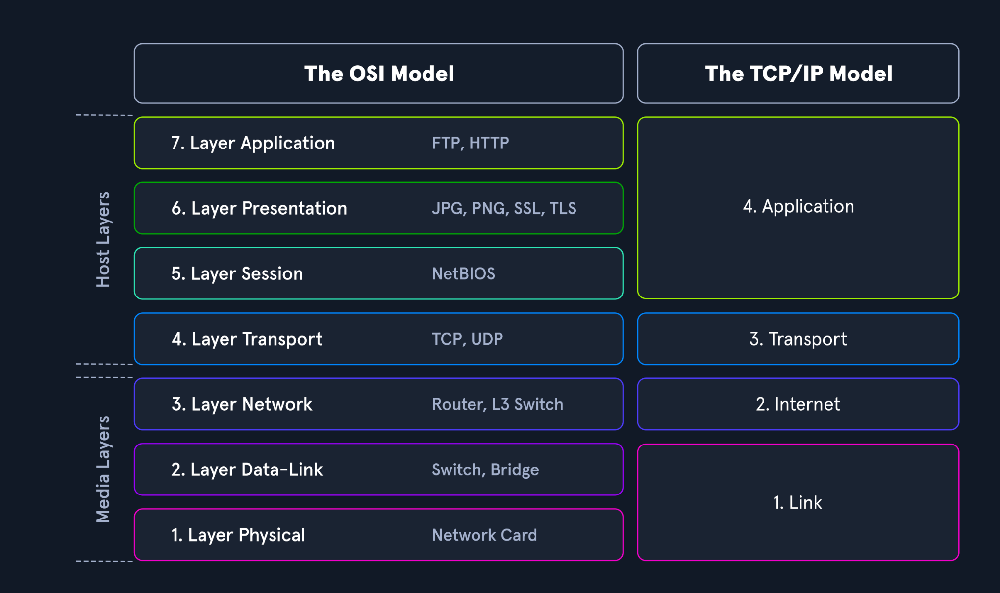
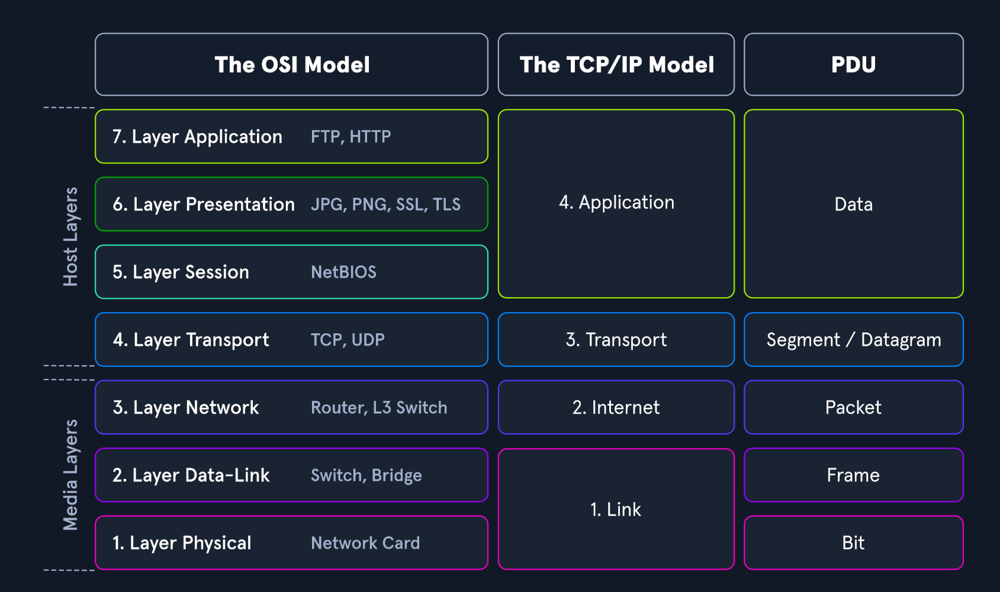

# Network Traffic Analysis

## Common Tools
- tcpdump
- Tshark
- NGrep
- tcpick	
- Network Taps
- Networking Span Ports	
- Elastic Stack
- SIEMS

## Networking Models
Source: [Hack The Box Academy](https://academy.hackthebox.com/)


## PDU Example
Source: [Hack The Box Academy](https://academy.hackthebox.com/)


## Analysis Dependencies
| Dependencies                             | Passive | Active | Description |
|------------------------------------------|:-------:|:-----:|-------------|
| Permission                               | ☑       | ☑     | Depending on the organization we are working in, capturing data can be against policy or even against the law in some sensitive areas like healthcare or banking. Be sure always to obtain permission in writing from someone with the proper authority to grant it to you. We may style ourselves as hackers, but we want to stay in the light legally and ethically. |
| Mirrored Port                            | ☑       | ☐     | A switch or router network interface configured to copy data from other sources to that specific interface, along with the capability to place your NIC into promiscuous mode. Having packets copied to our port allows us to inspect any traffic destined to the other links we could normally not have visibility over. Since VLANs and switch ports will not forward traffic outside of their broadcast domain, we have to be connected to the segment or have that traffic copied to our specific port. When dealing with wireless, passive can be a bit more complicated. We must be connected to the SSID we wish to capture traffic off of. Just passively listening to the airwaves around us will present us with many SSID broadcast advertisements, but not much else. |
| Capture Tool                             | ☑       | ☑     | A way to ingest the traffic. A computer with access to tools like TCPDump, Wireshark, Netminer, or others is sufficient. Keep in mind that when dealing with PCAP data, these files can get pretty large quickly. Each time we apply a filter to it in tools like Wireshark, it causes the application to parse that data again. This can be a resource-intensive process, so make sure the host has abundant resources. |
| In-line Placement                        | ☐       | ☑     | Placing a Tap in-line requires a topology change for the network you are working in. The source and destination hosts will not notice a difference in the traffic, but for the sake of routing and switching, it will be an invisible next hop the traffic passes through on its way to the destination. |
| Network Tap or Host With Multiple NIC's   | ☐       | ☑     | A computer with two NIC's, or a device such as a Network Tap is required to allow the data we are inspecting to flow still. Think of it as adding another router in the middle of a link. To actively capture the traffic, we will be duplicating data directly from the sources. The best placement for a tap is in a layer three link between switched segments. It allows for the capture of any traffic routing outside of the local network. A switched port or VLAN segmentation does not filter our view here. |
| Storage and Processing Power             | ☑       | ☑     | You will need plenty of storage space and processing power for traffic capture off a tap. Much more traffic is traversing a layer three link than just inside a switched LAN. Think of it like this; When we passively capture traffic inside a LAN, it's like pouring water into a cup from a water fountain. It's a steady stream but manageable. Actively grabbing traffic from a routed link is more like using a water hose to fill up a teacup. There is a lot more pressure behind the flow, and it can be a lot for the host to process and store. |


## Analysis in Practice
### Descriptive Analysis
- What is the issue?
    - Suspected breach? Networking issue?
- Define our scope and the goal. (what are we looking for? which time period?)
    - Target: multiple hosts potentially downloading a malicious file from bad.example.com
    - When: within the last 48 hours + 2 hours from now.
    - Supporting info: filenames/types 'superbad.exe' 'new-crypto-miner.exe'
- Define our target(s) (net / host(s) / protocol)
    - Scope: 192.168.100.0/24 network, protocols used were HTTP and FTP.
### Diagnostic Analysis
- Capture network traffic
    - Plug into a link with access to the 192.168.100.0/24 network to capture live traffic to try and grab one of the executables in transfer. See if an admin can pull PCAP and/or netflow data from our SIEM for the historical data.
- Identification of required network traffic components (filtering)
    - Once we have traffic, filter out any packets not needed for this investigation to include; any traffic that matches our common baseline and keep anything relevant to the scope of the investigation. For example, HTTP and FTP from the subnet, anything transferring or containing a GET request for the suspected executable files.
- An understanding of captured network traffic
    - Once we have filtered out the noise, it is time to dig for our targets—filter on things like ftp-data to find any files transferred and reconstruct them. For HTTP, we can filter on http.request.method == "GET" to see any GET requests that match the filenames we are searching for. This can show us who has acquired the files and potentially other transfers internal to the network on the same protocols.

### Predictive Analysis
- Note-taking and mind mapping of the found results
    - Annotating everything we do, see, or find throughout the investigation is crucial. Ensure we are taking ample notes, including:
    - Timeframes we captured traffic during.
    - Suspicious hosts within the network.
    - Conversations containing the files in question. ( to include timestamps and packet numbers)
- Summary of the analysis (what did we find?)
    - Finally, summarize what we have found explaining the relevant details so that superiors can decide to quarantine the affected hosts or perform more significant incident response.
    - Our analysis will affect decisions made, so it is essential to be as clear and concise as possible.

# TCPdump


## Controlls
| Switch Command     | Result                                                                                       |
|--------------------|----------------------------------------------------------------------------------------------|
| D                  | Will display any interfaces available to capture from.                                       |
| i                  | Selects an interface to capture from. ex. `-i eth0`                                          |
| n                  | Do not convert addresses (host addresses, port numbers, etc.) to names.                      |
| e                  | Will grab the Ethernet header along with upper-layer data.                                   |
| X                  | Show contents of packets in hex and ASCII.                                                   |
| XX                 | Same as X, but will also specify Ethernet headers (like using Xe).                           |
| v, vv, vvv         | Increase the verbosity of output shown and saved.                                            |
| c                  | Grab a specific number of packets, then quit the program.                                    |
| s                  | Defines how much of a packet to grab.                                                        |
| S                  | Change relative sequence numbers to absolute sequence numbers (e.g., `13248765839` instead of `101`). |
| q                  | Print less protocol information.                                                             |
| r file.pcap        | Read from a file.                                                                            |
| w file.pcap        | Write into a file.                                                                           |

## Filters
| Filter            | Result                                                                                           |
|-------------------|-------------------------------------------------------------------------------------------------|
| host              | Filters visible traffic to show anything involving the designated host (bi-directional).          |
| src / dest        | Modifiers to designate a source or destination host or port.                                     |
| net               | Shows traffic sourced from or destined to a specified network; uses CIDR `/` notation.            |
| proto             | Filters for a specific protocol type (e.g., ether, TCP, UDP, ICMP).                              |
| port              | Bi-directional; shows traffic with the specified port as either source or destination.           |
| portrange         | Allows specifying a range of ports (e.g., `0-1024`).                                             |
| less / greater <> | Filters by packet or protocol option size.                                                       |
| and / &&          | Combines two filters; both conditions must be met (e.g., `src host 10.0.0.1 and port 80`).       |
| or                | Matches traffic meeting either of two conditions.                                                |
| not               | Negates a condition (e.g., `not udp` shows all traffic except UDP).                              |

### Filter examples
- Filter for specific host
    - sudo tcpdump -i eth0 host 172.16.146.2
- Filter for a specific source port
    - sudo tcpdump -i eth0 tcp src port 80
- Filter for a whole destination network
    - sudo tcpdump -i eth0 dest net 172.16.146.0/24
- Filter portrange
    - sudo tcpdump -i eth0 portrange 0-1024
- Filter for packet size less than 64
    - sudo tcpdump -i eth0 less 64
- Filter for IP and Port
    - sudo tcpdump -i eth0 host 192.168.0.1 and port 23

### Pre-Capture Filters VS. Post-Capture Processing
Pre-capture filters: Applied during the capture; reduce file size and noise but may discard packets you might need later.
<br>
Post-capture processing: Capture everything first, then filter afterward; uses more storage but ensures no data is lost.

### Flags
| Flag        | Meaning                                                                 |
|------------|-------------------------------------------------------------------------|
| `Flags [.]`   | ACK only – acknowledgment of data, no SYN/FIN/RST.                     |
| `Flags [S]`   | SYN – connection initiation, first step of the 3-way handshake.        |
| `Flags [S.]`  | SYN+ACK – second step of the TCP 3-way handshake.                      |
| `Flags [R]`   | RST (Reset) – immediately terminates the connection.                   |
| `Flags [P.]`  | PUSH + ACK – first data packets after the handshake.                   |

#### TCP Handshake
| Step | TCP Flags   | Direction               | Description                                           |
|------|------------|------------------------|-------------------------------------------------------|
| 1    | SYN        | Client → Server        | Client initiates the connection (synchronizes sequence numbers). |
| 2    | SYN+ACK    | Server → Client        | Server acknowledges SYN and sends its own SYN.        |
| 3    | ACK        | Client → Server        | Client acknowledges server's SYN; handshake complete. |
| 4    | PUSH+ACK   | Client → Server        | Optional first data packet sent after the handshake.  |


# Wireshark
## Wireshark vs Tshark vs Termshark
- Wireshark: GUI
- Tshark: Terminal, Textbased
- Termshark: Terminal, GUI

## Filters
| Capture Filter                  | Result                                                                                   |
|---------------------------------|------------------------------------------------------------------------------------------|
| host x.x.x.x                     | Capture only traffic pertaining to a certain host.                                       |
| net x.x.x.x/24                   | Capture traffic to or from a specific network (using slash notation to specify the mask). |
| src/dst net x.x.x.x/24           | Capture traffic only from (`src`) or to (`dst`) the specified network.                   |
| port #                           | Capture only traffic for the specified port.                                             |
| not port #                       | Capture all traffic except the specified port.                                           |
| port # and #                     | Capture traffic matching both specified ports (logical AND).                             |
| portrange x-x                    | Capture traffic from all ports within the specified range.                               |
| ip / ether / tcp                 | Capture traffic for the specified protocol header (IP, Ethernet, or TCP).                |
| broadcast / multicast / unicast  | Capture a specific traffic type: one-to-one, one-to-many, or one-to-all.                 |
<br><br>
| Display Filter                 | Result                                                                                     |
|--------------------------------|--------------------------------------------------------------------------------------------|
| ip.addr == x.x.x.x              | Show traffic involving a specific host (acts as OR for src/dst).                           |
| ip.addr == x.x.x.x/24           | Show traffic involving a specific network (OR for src/dst).                                |
| ip.src/dst == x.x.x.x           | Show traffic only from (`src`) or to (`dst`) the specified host.                           |
| dns / tcp / ftp / arp / ip      | Filter traffic by a specific protocol (many options available).                            |
| tcp.port == x                   | Show traffic for a specific TCP port.                                                      |
| tcp.port / udp.port != x        | Show traffic for all ports except the specified one.                                       |
| and / or / not                  | Logical operators: AND combines, OR matches either, NOT excludes.                         |

## Follow TCP Stream
- GUI: Rightclick -> Follow -> Follow TCP Stream
- Filter: tcp.stream eq #

## Extracting Data and Files From a Capture
- GUI
    - File -> Export Object
    - HTTP -> choose File -> Save
- From Capture
    - stop your capture.
    - Select the File radial → Export → , then select the protocol format to extract from.
    - (DICOM, HTTP, SMB, etc.)
- FTP
    - filter: ftp.request.command
        - Lists Username & Passwords
    - filter: ftp-data
        - Lists Files
    
### FTP Workflow
- Identify any FTP traffic using the ftp display filter.
- Look at the command controls sent between the server and hosts to determine if anything was transferred and who did so with the ftp.request.command filter.
- Choose a file, then filter for ftp-data. Select a packet that corresponds with our file of interest and follow the TCP stream that correlates to it.
- Once done, Change "Show and save data as" to "Raw" and save the content as the original file name.
- Validate the extraction by checking the file type.

### RDP Decryption Manual

To view RDP traffic in cleartext, Wireshark needs the **server’s private RSA key**. Without this key, the TLS traffic remains encrypted.

---

## **Add the RDP Key to Wireshark**

1. Open **Wireshark → Edit → Preferences**
2. Navigate to **Protocols → TLS**
3. Under **RSA Keys List**, click **Edit (+)** to add a new key
4. Fill the fields as follows:

| Field          | Value                     |
| -------------- | ------------------------- |
| **IP Address** | `10.129.43.29`            |
| **Port**       | `3389`                    |
| **Protocol**   | `tpkt` *(or leave blank)* |
| **Key File**   | Path to your `server.key` |

5. Click **OK**, then **Save**
6. Reload your pcap file in Wireshark

---

After this, filter on RDP traffic:

```wireshark
rdp || tcp.port == 3389
```

You should now see **decrypted RDP packets** and can follow streams for analysis.
